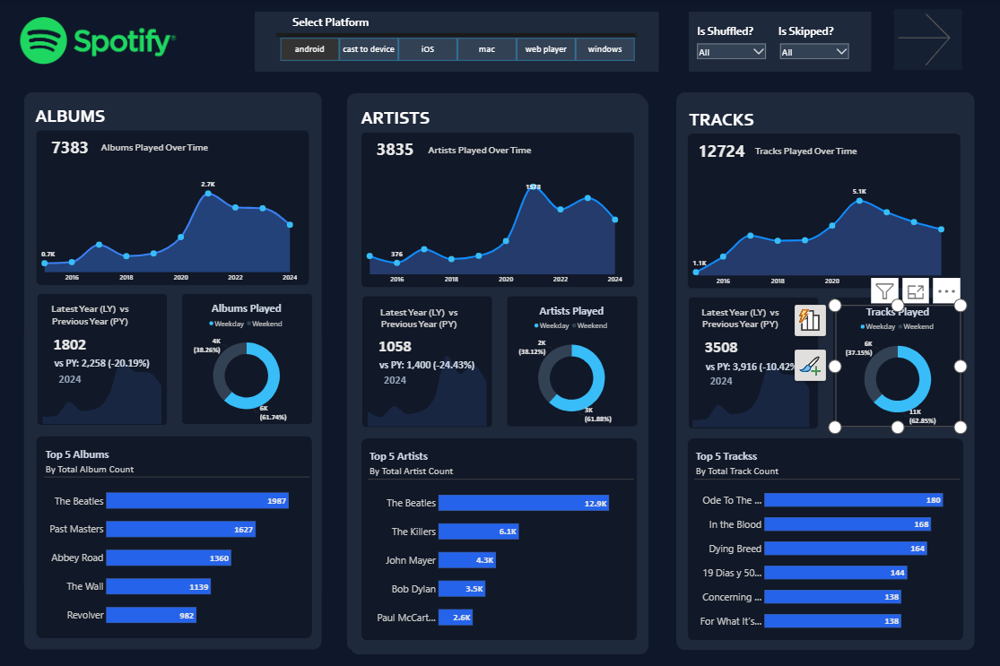
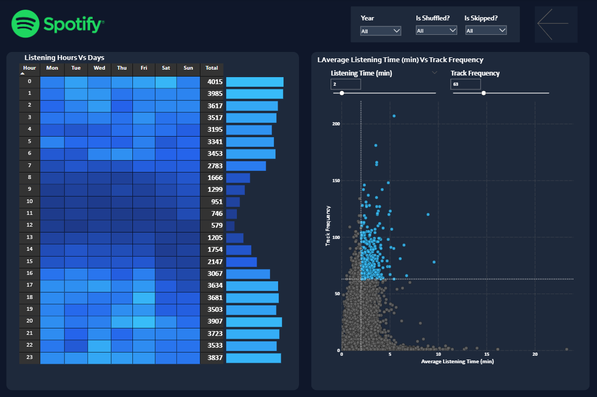
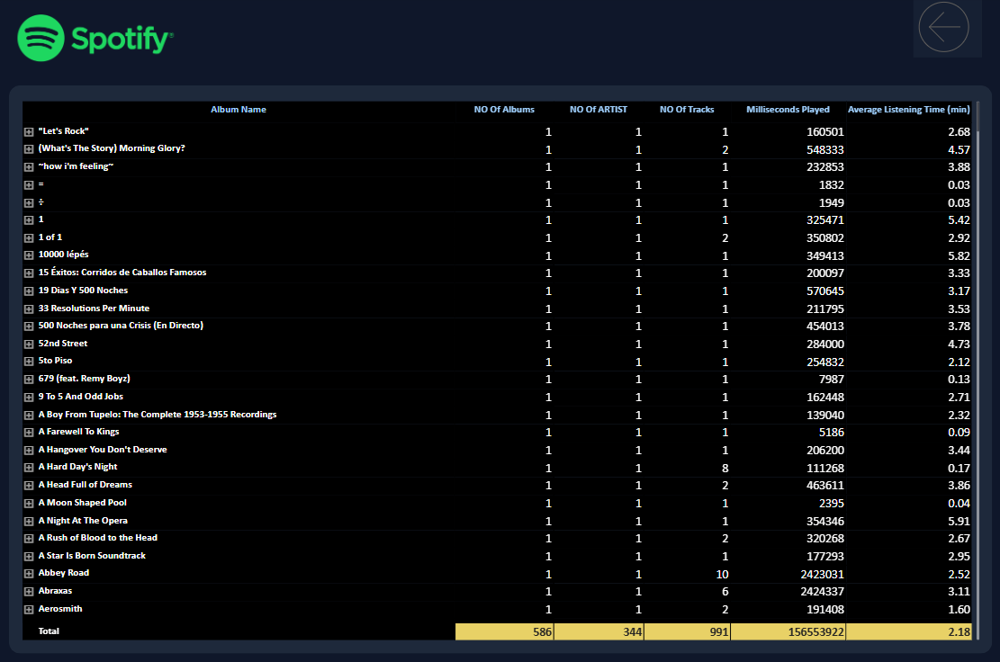

# Spotify-Listening-Analytics-Dashboard-PowerBI
An interactive Power BI dashboard for analyzing Spotify listening behavior using Power Query, DAX, data modeling, and drill-through reporting.
# 🎵 Spotify Listening Analytics Dashboard

An interactive **Power BI dashboard** built to analyze Spotify listening behavior using **Power Query, DAX, Data Modeling, and Data Visualization**.

---

## 📌 Project Overview

This dashboard transforms Spotify listening history into meaningful business insights through interactive reports and dynamic visualizations. It enables users to explore listening trends, identify top-performing albums, artists, and tracks, analyze listening behavior across different hours, and perform detailed drill-through analysis.

---

## 🚀 Dashboard Features

- 📊 Interactive KPI Cards
- 🎵 Album, Artist & Track Analysis
- 📈 Listening Trend Analysis
- 🕒 Hour-wise Listening Pattern Analysis
- 📅 Weekday vs Weekend Comparison
- 🎛 Interactive Platform Filters
- 🔍 Drill-through Details Page
- 🎨 Conditional Formatting
- 📄 Multi-page Dashboard Navigation

---

## 🛠 Tools & Technologies

- Power BI Desktop
- Power Query
- DAX
- Data Modeling
- Data Visualization

---

## 📄 Dashboard Pages

### 📍 Page 1 — Overview

- Overall Listening Summary
- Albums, Artists & Tracks KPIs
- Listening Trends
- Top 5 Albums
- Top 5 Artists
- Top 5 Tracks
- Weekday vs Weekend Comparison

---

### 📍 Page 2 — Listening Patterns

- Hour-wise Listening Analysis
- Interactive Matrix
- Platform-based Filtering
- Time-based Listening Insights

---

### 📍 Page 3 — Details

- Drill-through Analysis
- Record-level Listening Insights

---

## 💡 Skills Demonstrated

- Data Cleaning
- Data Transformation
- DAX Calculations
- Data Modeling
- Interactive Dashboard Design
- Conditional Formatting
- Drill-through Reporting
- Business Intelligence Reporting

---

# 📸 Dashboard Preview

## 🏠 Overview

---

## 🎧 Listening Patterns

---

## 📋 Details

---

## ⭐ If you found this project interesting, feel free to star the repository.
